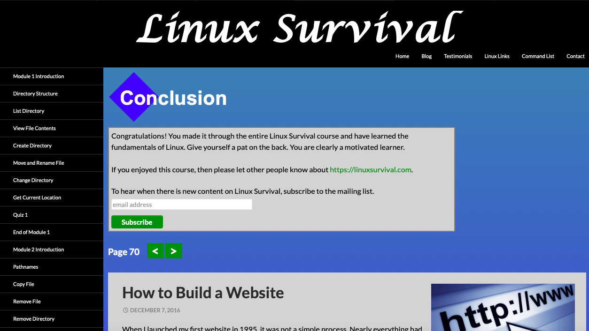
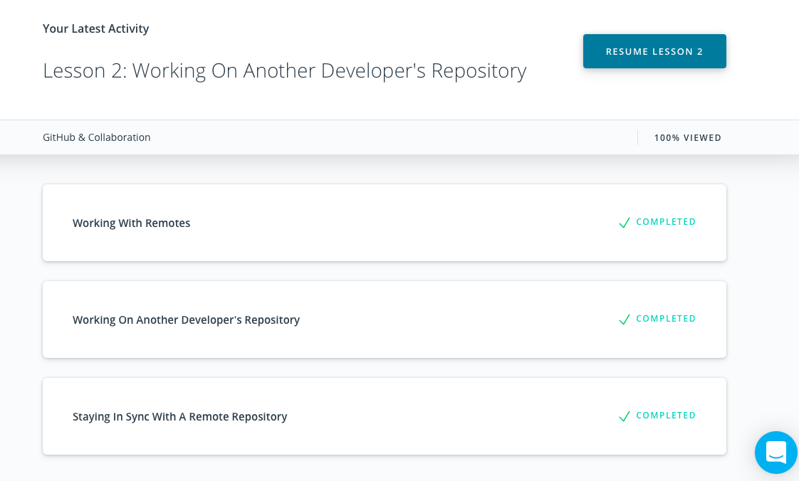

# kottans-frontend
***
## Linux CLI, and HTTP -- #Done

**Never Know before that HTTP are so compliate and powerful**

***

## Git Collaboration -- #Done
***

**Suprise that github could share and protect a file for each dev too**
